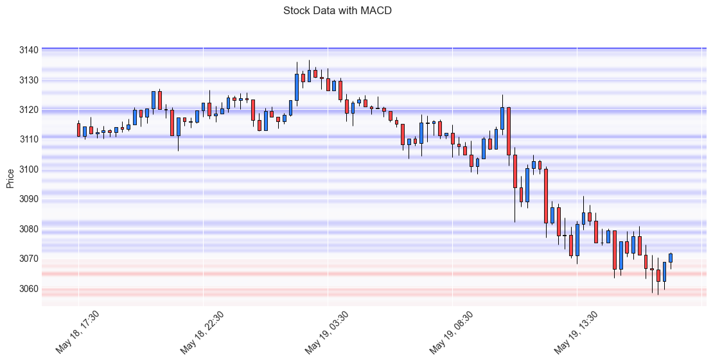

## Traderbor
 
In short: it is attempt at using gpt-4 for taking trading decisions. 
- Prompt is composed of some instructions and chart images
  - Candlebar chart (with some indicators like MACD, volume or bid ask aka market depth)
  - Relevant news fetched using different providers and extracted using another agent
- LLM is asked to analyze charts, calculate movement and calculate likelyhood, gain and loss in case of each action
  - buy at this point of time (using leverage or without)
  - sell what is currently obtained (using leverage or without)
  - hold and do nothing
- Then it is asked to verify the results and calculations (simple chain of thoughts xD)
- Based on all of this is makes final decision

This is executed "offline" on historical data, we fetch data for a year and then based on candle situation at each point in time decides if trade is successfull or not (i suspect this part does not work super well and can be improved)

As a baseline "random trader" is taken, which is just doing the same but based on random guess of current action (buy sell or hold)

In short-term tests it performed similar to LLM agent, but in a long run it tends to loose dramatically.

---
---

Chart shows amount of current buy/sell orders with colored lines, thicker and brighter lines indicate bigger volume.

I found this kind of visualization is quite uncommong and interesting showing how support levels work, while it's practical use is still questionable.

